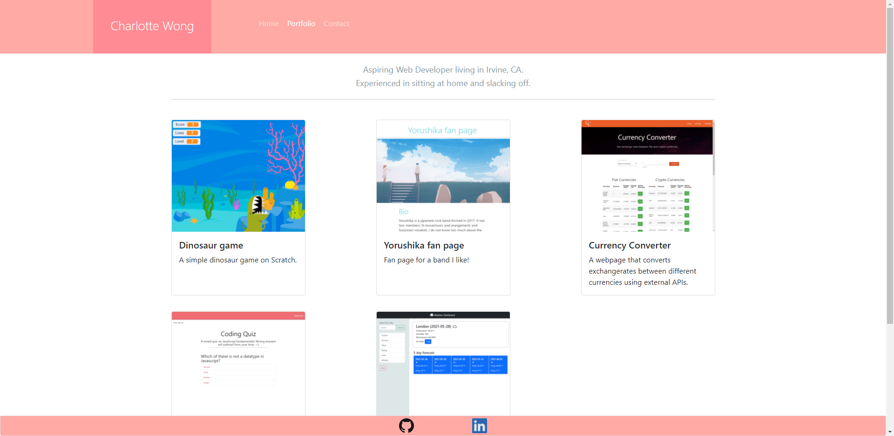

# MyPortfolio

A portfolio page to showcase the work I've done so far!

Deployed portfolio url:
https://charlottefrancis.github.io/MyPortfolio/

Written in html and CSS, styled using the bootstrap library. 

I feel like there is still a lot that could be done to make this page look nicer but I'm not exactly sure how to go about it! I am happy with the cards on the portfolio page though, the design is made so that I can add on more cards in the future! I hope I can have a wall of stuff to scroll down in the future. Even though I have this hope though I heard that people who look at portfolios only want to see 3-5 really really good projects so maybe I'll make another project for myself that just has a wall of my projects for scrolling :P

The following image is of the deployed website's portfolio page:

